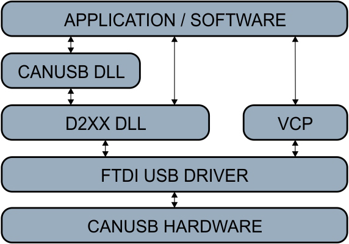

# FTD2XX Lawicel CANUSB Probe

A cross-platform Node.js FTDI D2XX + Lawicel test utility for reverse engineering, validating, and emulating CANUSB-compatible USB CAN dongles.

This project exists to validate the real software path used by applications that communicate through FTDI D2XX rather than a normal COM port.

On Windows, the production-style path is usually:

```text
Application
 -> canusbdrv.dll
    -> ftd2xx.dll
       -> FTDI USB device
          -> Lawicel firmware
             -> CAN controller
```

On Linux, this probe uses the equivalent FTDI D2XX shared library:

```text
node index.js
 -> libftd2xx.so
    -> FTDI USB device
       -> Lawicel firmware
          -> CAN controller
```

Unlike simple COM-port terminal testing, this project exercises the D2XX driver path directly.



---

## Why This Exists

Many CANUSB-compatible Windows applications do not talk to COM ports directly.

Instead, they:

- load `canusbdrv.dll`
- which internally loads `ftd2xx.dll`
- which communicates directly with FTDI USB devices

That means a dongle can:

- work perfectly as `COM7`
- respond correctly in PuTTY
- still fail completely through the D2XX path

This utility helps determine where compatibility breaks.

| Test Method | What It Actually Validates |
|---|---|
| PuTTY / COM port | VCP serial path only |
| FT_Prog sees device | FTDI EEPROM / D2XX visibility |
| This project | D2XX byte-stream communication |
| Real target app | Full production stack |

---

## Goals

This utility validates:

- FTDI driver installation
- D2XX library loading
- D2XX enumeration
- D2XX open/close behavior
- `FT_Write()` / `FT_Read()` functionality
- Lawicel ASCII command handling
- CAN bitrate initialization
- CAN transmit framing

It is especially useful when building or testing:

- CANUSB dongles
- Lawicel emulators
- FTDI-based CAN bridges
- reverse engineering tools
- compatibility validation harnesses

---

## Project Stack

| Component | Purpose |
|---|---|
| Node.js | Runtime |
| koffi | Native FFI |
| `ftd2xx.dll` | Windows FTDI D2XX API |
| `libftd2xx.so` | Linux FTDI D2XX API |
| FTDI D2XX driver | USB transport |
| Lawicel ASCII | CANUSB protocol |

---

## Directory Layout

```text
ftd2xx-probe/
├── index.js
├── package.json
├── package-lock.json
├── README.md
├── ftd2xx.dll          # optional, Windows local copy
├── libftd2xx.so        # optional, Linux local copy
└── images/
    └── driverdiagram.jpg
```

You do not need both `ftd2xx.dll` and `libftd2xx.so` on the same machine. The script chooses the correct library for the current OS.

---

## Requirements

### Node.js

Recommended:

- Node.js 18.x
- Node.js 20.x

Install dependencies:

```bash
npm install
```

Architecture must match the native D2XX library:

| Runtime | Native Library |
|---|---|
| x64 Node | x64 D2XX library |
| x86 Node | x86 D2XX library |
| arm64 Node | arm64 D2XX library |

---

## Windows Requirements

Install the FTDI D2XX driver package from FTDI, or place `ftd2xx.dll` beside `index.js`.

The script tries:

```text
./ftd2xx.dll
ftd2xx.dll
```

Useful validation:

- Device appears in Device Manager
- FT_Prog can detect the device
- `FT_CreateDeviceInfoList()` returns device count greater than zero

---

## Linux Requirements

Install FTDI's Linux D2XX shared library, or place `libftd2xx.so` beside `index.js`.

The script tries:

```text
./libftd2xx.so
libftd2xx.so
```

If the library is installed globally but the loader cannot find it, update the dynamic linker cache or use `LD_LIBRARY_PATH`.

Examples:

```bash
sudo ldconfig
```

or:

```bash
LD_LIBRARY_PATH=. node index.js
```

On Linux, the kernel VCP driver may claim the FTDI device before D2XX can use it. If the D2XX library loads but no device is found, try unloading the VCP drivers:

```bash
sudo rmmod ftdi_sio
sudo rmmod usbserial
```

That is only needed for direct D2XX access. If you are testing through `/dev/ttyUSB0`, you are testing the VCP path instead.

---

## Missing Library Output

If the D2XX library is missing, the script exits cleanly instead of dumping a Node stack trace.

Example on Linux:

```text
D2XX library not found or could not be loaded.

Platform: Linux (linux, x64)
Tried:
  - /path/to/ftd2xx-probe/libftd2xx.so
  - libftd2xx.so

Place libftd2xx.so beside index.js, or install it where the dynamic linker can find it.

Linux notes:
  - FTDI D2XX uses libftd2xx.so, not ftd2xx.dll.
  - If the library is installed in a custom location, run ldconfig or set LD_LIBRARY_PATH.
  - If no devices are found later, the kernel VCP driver may have claimed the device:
      sudo rmmod ftdi_sio
      sudo rmmod usbserial

Use --verbose-lib-load to show the raw loader errors.
```

For raw loader details:

```bash
node index.js --verbose-lib-load
```

---

## Running

### Default Probe

```bash
node index.js
```

This performs:

1. D2XX library load
2. FTDI device enumeration
3. `FT_Open()`
4. timeout configuration
5. Lawicel initialization sequence:
   - `V`
   - `N`
   - `C`
   - `S6`
   - `O`
6. passive receive test
7. `FT_Close()`

---

## Command-Line Usage

### Send Arbitrary Lawicel Command

```bash
node index.js --cmd V
```

```bash
node index.js --cmd N
```

```bash
node index.js --cmd S6
```

---

### Transmit CAN Frame

```bash
node index.js --tx 231 8 EB90010C0413101F
```

Which generates:

```text
t2318EB90010C0413101F
```

and sends it through:

```text
FT_Write()
 -> Lawicel firmware
```

---

### Select FTDI Device Index

```bash
node index.js --index 1
```

Default:

```text
--index 0
```

---

### Set FTDI UART Baud

```bash
node index.js --ft-baud 500000
```

Important: this is not CAN bitrate.

This configures the FTDI UART transport layer. CAN bitrate is configured separately with a Lawicel command:

```text
S6 = 500k CAN
```

---

## Typical Successful Output

```text
D2XX Lawicel CANUSB probe
Platform: Linux (linux, x64)
Target app behavior: canusb_Open(adapter, "500", 0, 0xFFFFFFFF, 1)
Lawicel CAN bitrate command for 500k: S6

FT_CreateDeviceInfoList: 0 FT_OK
FTDI/D2XX-visible device count: 1
FT_Open(0): 0 FT_OK
Handle: 12345678

FT_SetBaudRate: skipped. CAN bitrate is handled by Lawicel S6, not FT_SetBaudRate.
FT_SetDataCharacteristics(8N1): 0 FT_OK
FT_SetTimeouts(10,10): 0 FT_OK
FT_Purge(RX|TX): 0 FT_OK

--- Lawicel version ---
TX ascii: "V\r" / 56 0d / wrote=2 / 0 FT_OK
RX ascii: "V1234\r"

--- Lawicel serial ---
TX ascii: "N\r" / 4e 0d / wrote=2 / 0 FT_OK
RX ascii: "N0001\r"
```

---

## Lawicel Commands

The utility speaks standard Lawicel ASCII.

| Command | Meaning |
|---|---|
| `V` | firmware version |
| `N` | serial number |
| `C` | close CAN channel |
| `S6` | set CAN bitrate 500k |
| `O` | open CAN channel |
| `t12381122334455667788` | transmit standard 11-bit CAN frame |

---

## Important Concepts

### VCP vs D2XX

This project intentionally bypasses COM ports.

VCP path:

```text
Application
 -> COM7 or /dev/ttyUSB0
    -> FTDI VCP driver
```

D2XX path:

```text
Application
 -> ftd2xx.dll or libftd2xx.so
    -> FTDI D2XX driver
```

These are different stacks.

A device may work in one but fail in the other.

---

### Why COM Port Testing Is Insufficient

PuTTY or `screen /dev/ttyUSB0` proving that this works:

```text
V\r
```

only validates COM-port serial transport.

It does not prove these will function correctly through D2XX:

```text
FT_Open()
FT_Write()
FT_Read()
```

This utility specifically validates the D2XX path.

---

## FTDI Device Compatibility

Devices must be genuine or D2XX-compatible FTDI hardware.

Examples that often work:

- FT232R
- FT232H
- FT2232H

Examples that generally do not work with D2XX:

- CH340
- CP2102
- candleLight CAN adapters
- generic USB CDC devices

Reason: FTDI D2XX communicates with FTDI-compatible hardware, not arbitrary USB serial devices.

---

## Compatible Dongle Development Workflow

Recommended progression:

| Stage | Goal |
|---|---|
| FT_Prog detection | verify FTDI visibility |
| This utility enumeration | verify D2XX access |
| Lawicel `V` response | verify protocol |
| `S6` / `O` | verify CAN init |
| CAN TX/RX | verify full behavior |
| Real app test | validate production compatibility |

---

## Useful FTDI APIs

The utility currently uses:

| API | Purpose |
|---|---|
| `FT_CreateDeviceInfoList()` | enumerate devices |
| `FT_Open()` | open FTDI device |
| `FT_SetBaudRate()` | optional FTDI transport baud |
| `FT_SetDataCharacteristics()` | configure 8N1 |
| `FT_SetTimeouts()` | configure RX/TX timeouts |
| `FT_Purge()` | clear RX/TX queues |
| `FT_Write()` | transmit Lawicel commands |
| `FT_Read()` | receive responses |
| `FT_Close()` | close device |

Potential future additions:

- `FT_GetDeviceInfoDetail()`
- `FT_ListDevices()`
- EEPROM inspection
- latency timer tuning
- async read loop
- CAN frame parser
- continuous monitor mode

---

## CANUSB Support

Manuals, drivers, example software, and projects for the LAWICEL CANUSB:

- https://www.canusb.com/support/canusb-support/

---

## LAWICEL / SLCAN Protocol Resources

The term LAWICEL can be slightly confusing because it refers to both:

- the original company/vendor
- the de-facto ASCII CAN serial protocol commonly used by CANUSB adapters

Over time, the protocol became widely known in Linux and SocketCAN ecosystems as:

```text
slcan
```

short for Serial Line CAN.

Typical commands include:

```text
V
N
S6
O
C
t12381122334455667788
```

These commands are commonly transported over:

- FTDI USB serial devices
- D2XX driver stacks
- virtual COM ports / VCP
- USB CAN dongles

---

## Recommended References

### Official LAWICEL / CANUSB Resources

- [LAWICEL CANUSB Support](https://www.canusb.com/support/canusb-support/)
- [CAN232 Protocol Reference PDF](https://www.canusb.com/files/can232_v3.pdf)
- [CANUSB Manual PDF](https://www.canusb.com/files/canusb_manual.pdf)

The CAN232 documentation is especially useful because it effectively became the reference specification for the LAWICEL ASCII protocol.

---

### Linux / SocketCAN / SLCAN Resources

The Linux ecosystem often refers to the LAWICEL protocol as SLCAN.

Useful resources:

- [Linux SocketCAN Documentation](https://www.kernel.org/doc/html/latest/networking/can.html)
- [python-can SLCAN Documentation](https://python-can.readthedocs.io/en/stable/interfaces/slcan.html)

Useful search terms:

```text
slcan protocol
socketcan slcan
slcand
LAWICEL ASCII CAN
CAN232 protocol
```

---

## Reverse Engineering Notes

This project was built to support:

- Lawicel CANUSB emulation
- FTDI USB reverse engineering
- hardware validation
- proprietary automotive tooling analysis
- CAN bridge development

The utility intentionally exposes low-level D2XX behavior rather than abstracting it away.

---

## License

MIT License

Reverse engineering / interoperability / educational use.

No affiliation with FTDI, Lawicel, PEAK, or CANUSB vendors.

## Disclaimer

This project is an independent interoperability and testing utility.

All trademarks belong to their respective owners.

Users are responsible for obtaining vendor drivers and SDK components from official sources.
